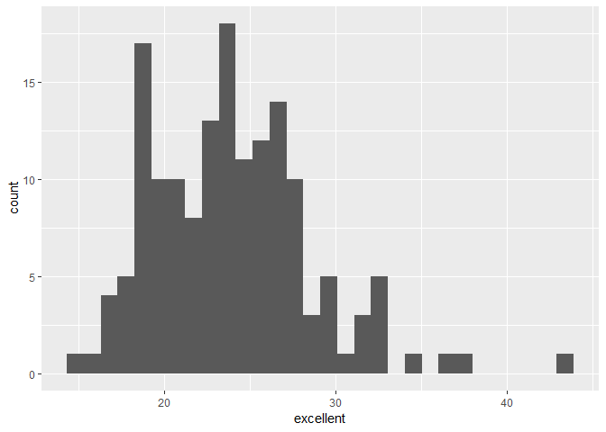
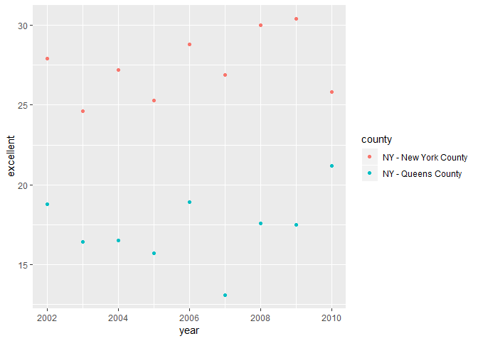

p8105\_hw2\_smi2112
================

Problem 1
---------

Read and clean the data:

``` r
library(tidyverse)
```

    ## -- Attaching packages -------------------------------------------------------------------------------------------------------------------------- tidyverse 1.2.1 --

    ## v ggplot2 3.0.0     v purrr   0.2.5
    ## v tibble  1.4.2     v dplyr   0.7.6
    ## v tidyr   0.8.1     v stringr 1.3.1
    ## v readr   1.1.1     v forcats 0.3.0

    ## -- Conflicts ----------------------------------------------------------------------------------------------------------------------------- tidyverse_conflicts() --
    ## x dplyr::filter() masks stats::filter()
    ## x dplyr::lag()    masks stats::lag()

``` r
transit_data = read_csv(file = "./data/NYC_Transit_Subway_Entrance_And_Exit_Data.csv") %>% 
  janitor::clean_names() %>%
  select(line, station_name, station_latitude, station_longitude, route1:route11, entry, vending, entrance_type, ada) %>% 
  mutate(entry = if_else(entry == "YES", TRUE, FALSE))
```

    ## Parsed with column specification:
    ## cols(
    ##   .default = col_character(),
    ##   `Station Latitude` = col_double(),
    ##   `Station Longitude` = col_double(),
    ##   Route8 = col_integer(),
    ##   Route9 = col_integer(),
    ##   Route10 = col_integer(),
    ##   Route11 = col_integer(),
    ##   ADA = col_logical(),
    ##   `Free Crossover` = col_logical(),
    ##   `Entrance Latitude` = col_double(),
    ##   `Entrance Longitude` = col_double()
    ## )

    ## See spec(...) for full column specifications.

Short paragraph about this dataset:

The dataset contains the variables line, station name, station latitude and longitude, routes 1 through 11, entry availability, vending availability, entrance type, and ada compliance. I have used the janitor package to clean the names of the variables to make them lowercase and without spaces, and I have changed the data type of the entry variable from character to logical. The dataset dimensions are 1868, 19 (1868 rows, 19 columns). These data are not tidy yet, because every column is not a variable; to make the dataset tidy routes 1-11 would be observations.

Answering questions:

``` r
transit_data %>% 
  select(line, station_name) %>% 
  n_distinct()
```

    ## [1] 465

There are 465 distinct stations.

``` r
transit_data %>%
  select(line, station_name, ada) %>% 
  filter(ada == TRUE) %>%
  group_by(line, station_name) %>% 
  n_distinct()
```

    ## [1] 84

There are 84 ADA compliant stations.

``` r
transit_data %>% 
  select(line, station_name, vending, entry) %>% 
  filter(vending == "NO") %>% 
  distinct() %>% 
  summarise(mean(entry))
```

    ## # A tibble: 1 x 1
    ##   `mean(entry)`
    ##           <dbl>
    ## 1         0.387

The proportion of station entrances/exits without vending that allow entrace is 0.387.

Reformatting data so route number and route name are distinct variables:

``` r
transit_data_tidy = gather(transit_data, key = route_number, value = route_name, route1:route11) %>% 
  mutate(route_number = recode(route_number, 
                               "route1" = 1, 
                               "route2" = 2, 
                               "route3" = 3,
                               "route4" = 4, 
                               "route5" = 5, 
                               "route6" = 6, 
                               "route7" = 7, 
                               "route8" = 8, 
                               "route9" = 9, 
                               "route10" = 10, 
                               "route11" = 11)) 
```

Answering questions:

``` r
transit_data_tidy %>%
  select(line, station_name, route_name) %>% 
  filter(route_name == "A") %>% 
  n_distinct()
```

    ## [1] 60

There are 60 distinct stations that serve the A train.

``` r
transit_data_tidy %>%
  select(line, station_name, route_name, ada) %>% 
  filter(route_name == "A" & ada == TRUE) %>% 
  n_distinct()
```

    ## [1] 17

There are 17 distinct stations serving the A train that are ADA compliant.

Problem 2
---------

Reading and cleaning the Mr. Trash Wheel sheet:

``` r
library(readxl)

mr_trash = read_excel("./data/HealthyHarborWaterWheelTotals2018-7-28.xlsx", "Mr. Trash Wheel", range = cell_cols("A:N")) %>%
  janitor::clean_names() %>% 
  filter(., !is.na(dumpster)) %>% 
  mutate(sports_balls = as.integer(round(sports_balls)))
```

Reading and cleaning the precipitation data for 2016 and 2017:

``` r
precip_2016 = read_excel("./data/HealthyHarborWaterWheelTotals2018-7-28.xlsx", "2016 Precipitation", range = cell_rows(2:14)) %>% 
  janitor::clean_names() %>% 
  mutate(year = 2016)

precip_2017 = read_excel("./data/HealthyHarborWaterWheelTotals2018-7-28.xlsx", "2017 Precipitation", range = cell_rows(2:14)) %>% 
  janitor::clean_names() %>% 
  mutate(year = 2017)

month_info = tibble(
  month = 1:12, 
  month_name = month.name)

precip = union(precip_2016, precip_2017, by = "month") %>% 
  inner_join(., month_info, by = "month") %>% 
  select(-"month")
```

Paragraph about these data:

There are 285 observations in the Mr. Trash Wheel dataset. There are 24 observations in the precipitation dataset. Some key variables of interest are as follows: There was 16.0909091 cubic yards of trash in 2017, and 3.1789091 tons of trash in 2017. There was 32.93 inches of precipitation in 2017. The median number of sports balls in a dumpster in 2016 was 26.

Problem 3
---------

Loading BRFSS data from p8105.datasets package:

``` r
devtools::install_github("p8105/p8105.datasets")
```

    ## Skipping install of 'p8105.datasets' from a github remote, the SHA1 (21f5ad1c) has not changed since last install.
    ##   Use `force = TRUE` to force installation

``` r
library(p8105.datasets)
data("brfss_smart2010")
```

Formatting the data:

``` r
brfss = brfss_smart2010 %>% 
  janitor::clean_names() %>% 
  filter(topic == "Overall Health") %>% 
  rename(state = locationabbr, county = locationdesc) %>% 
  select(response, everything()) %>% 
  select(-class, -topic, -question, -sample_size, -c(confidence_limit_low:geo_location)) %>% 
  spread(key = response, value = data_value) %>% 
  janitor::clean_names() %>% 
  mutate(excellent_verygood = excellent + very_good)
```

There are 404 unique locations.

There are 51 states. Every state is represented, with Washington DC represented as well.

``` r
brfss %>% 
  select(state) %>% 
  group_by(state) %>% 
  count(state) %>% 
  arrange(desc(n))
```

    ## # A tibble: 51 x 2
    ## # Groups:   state [51]
    ##    state     n
    ##    <chr> <int>
    ##  1 NJ      146
    ##  2 FL      122
    ##  3 NC      115
    ##  4 WA       97
    ##  5 MD       90
    ##  6 MA       79
    ##  7 TX       71
    ##  8 NY       65
    ##  9 SC       63
    ## 10 CO       59
    ## # ... with 41 more rows

New Jersey has the most observations.

In 2002, the median of the "Excellent" response value was 23.6.

Histogram of "Excellent" response values in the year 2002:

``` r
brfss %>% 
  filter(year == 2002) %>% 
  ggplot(., aes(x = excellent)) + geom_histogram()
```

    ## `stat_bin()` using `bins = 30`. Pick better value with `binwidth`.

    ## Warning: Removed 2 rows containing non-finite values (stat_bin).



Scatterplot of proportion of "Excellent" response values in New York County and Queens county in each year from 2002 to 2010:

``` r
brfss %>% 
  filter(county == "NY - New York County" | county == "NY - Queens County") %>% 
  ggplot(., aes(x = year, y = excellent, color = county)) + geom_point()
```


